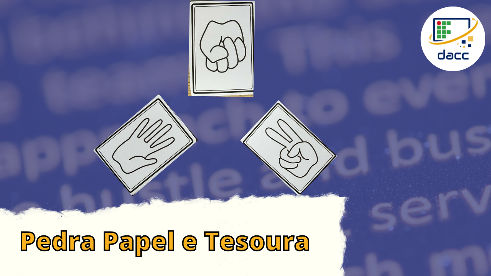

:sparkles: :sparkles:  Olá a todos, Sejam Bem Vindos!  :sparkles: :sparkles:

 

### Sobre Nós :computer:
O projeto RoadMap Python veio para difundir conhecimentos da linguagem Python,como criar seu primeiro jogo ou automatizar uma tarefa cotidiana, o projeto é realizado por estudantes do Campus Rio Pomba, sendo um aluno da Graduação e um do Ensino Técnico, um projeto de alunos para alunos, seja bem vindo ao RoadMap Python.

| Live | IDE | Link do Vídeo |Códigos|
|--- |--- |--- |--- |
| Criação de um jogo(Pedra, Papel e Tesoura) em python | Google Colab ||[Repositório Aqui!](https://github.com/RoadMapPython/Pedra-papel-e-tesoura)|
| Simulador da Vida de um Desenvolvedor | Google Colab |  |[Repositório Aqui!](https://github.com/RoadMapPython/Simulador-Vida-de-um-des)|
| Interface Gráfica Jokenpo | Visual Studio Code | |[Repositório Aqui!](https://github.com/RoadMapPython/Interface-Grafica)|
| Web-Scraping | Atom |  |[Repositório Aqui!](https://github.com/RoadMapPython/Web-Scraping)|
| Python e OpenCV | Visual Studio Code | <a href="https://www.youtube.com/watch?v=Y21jK7Dl3-Y">Link da Live</a>|[Repositório Aqui!](https://github.com/RoadMapPython/Conceitos-Iniciais-Open-Cv)|
| Filtros-de-Instagram | Google Colab |  |[Repositório Aqui!](https://github.com/RoadMapPython/Filtros-de-Instagram)|
| PyAutoGUI | Visual Studio Code | |[Repositório Aqui!](https://github.com/RoadMapPython/PyAutoGUI)|
| Live-jogo-da-forca | Visual Studio Code | |[Repositório Aqui!](https://github.com/RoadMapPython/Live-jogo-da-forca)|
| Minicurso-python| Visual Studio Code |<a href="https://www.youtube.com/watch?v=DQZ6fMfsrWs">|[Repositório Aqui!](https://github.com/RoadMapPython/Minicurso-python)|
| Manipulando documentos em Python | Jupyter notebook |  |[Repositório Aqui!](https://github.com/RoadMapPython/Manipulando-documentos-em-python)|
| Relógio gráfico e introdução ao GIT | Visual Studio Code | |[Repositório Aqui!](https://github.com/RoadMapPython/Relogio-Grafico-e-GIT)|
| Flask | Visual Studio Code | <a href="https://www.youtube.com/watch?v=pu2LbA1cIQs">Link da Live</a>|[Repositório Aqui!](https://github.com/RoadMapPython/)|
